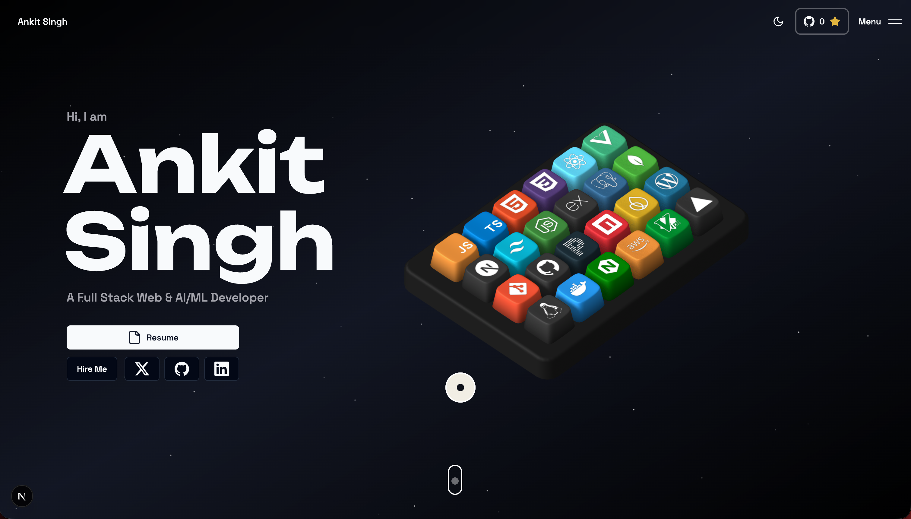

<div align="center">
  

  <h1>🚀 Ankit Singh | 3D Interactive Portfolio</h1>
  
  <p>
    <strong>A jaw-dropping, space-themed developer portfolio packed with interactive 3D animations, buttery smooth transitions, and premium UI components.</strong>
  </p>

  <p>
    <a href="https://ankitsingh.site"></a>
    <a href="https://github.com/Singhankit001"></a>
    <a href="https://www.linkedin.com/in/singhankit001/"></a>
  </p>
</div>

---

## 📖 About the Project

Welcome to my personal slice of the internet! As an **AI/ML & Full-Stack Developer**, I wanted a portfolio that goes beyond the standard static page. This project serves as an interactive experience, combining 3D web technologies with modern frontend frameworks to create a cosmic, immersive environment that showcases my skills, projects, and professional journey.

Whether you're exploring the 3D interactive keyboard, checking out my latest SaaS products, or just enjoying the floating particles—this portfolio is designed to leave a lasting impression.

## ✨ Key Features

- **🎮 Interactive 3D Keyboard (Spline)** 
  A custom-built 3D keyboard where each keycap is bound to a specific skill or technology. Hovering over or clicking the keys reveals detailed tooltips and dynamic descriptions about my expertise.
  
- **🌌 Space-Themed Aesthetics & Particles**
  A beautifully crafted dark canvas featuring floating cosmic particles that react to scroll and layout changes, providing a deep, immersive spatial feel.

- **🎬 Buttery Smooth Animations**
  Powered by GSAP and Framer Motion, every section seamlessly reveals itself as you scroll. Parallax effects, stagger animations, and text reveals ensure the site feels "alive".

- **🌓 Dynamic Theme Support**
  Fully supports both Light and Dark modes. The typography, shadows (including neon glowing text effects), and backgrounds adapt instantly for perfect accessibility and aesthetics.

- **⚡ Blazing Fast Performance**
  Built on Next.js 14 with Server Components, optimized images, and Turbopack for maximum speed and SEO optimization.

- **📬 Direct Google Forms Integration**
  A seamless, headless contact form that silently submits inquiries directly to a private Google Form backend, preventing spam while keeping the UX entirely native to the site.

## 🛠️ Tech Stack Architecture

This project was built using the best and most modern tools available in the web ecosystem:

### **Core Framework**
- **[Next.js 14](https://nextjs.org/)** (App Router)
- **[React 18](https://react.dev/)**
- **[TypeScript](https://www.typescriptlang.org/)** for strict type safety

### **Styling & UI Components**
- **[Tailwind CSS](https://tailwindcss.com/)** for utility-first styling
- **[Shadcn UI](https://ui.shadcn.com/)** for accessible, headless components
- **[Aceternity UI](https://ui.aceternity.com/)** for premium, complex animated UI blocks

### **3D & Animations**
- **[Spline Runtime](https://spline.design/)** for rendering and interacting with the 3D keyboard
- **[Framer Motion](https://www.framer.com/motion/)** for page transitions and micro-interactions
- **[GSAP](https://gsap.com/)** for high-performance scroll-driven animations

## 🚀 Getting Started

Want to run this locally or use it as inspiration? Follow these steps:

### Prerequisites
Make sure you have the following installed:
- Node.js (v18+)
- `pnpm` (highly recommended), `npm`, or `yarn`

### Installation

1. **Clone the repository:**
   ```bash
   git clone https://github.com/Singhankit001/Portfolio.git
   cd Portfolio
   ```

2. **Install dependencies:**
   ```bash
   pnpm install
   ```

3. **Environment Setup:**
   Copy the example environment variables to your local config.
   ```bash
   cp .env.example .env.local
   ```
   *(Update the `.env.local` file with your specific API keys if you plan to extend backend functionality).*

4. **Run the development server:**
   ```bash
   pnpm dev
   ```

5. **Blast off! 🚀**
   Open [http://localhost:3000](http://localhost:3000) in your browser to see the magic.

## 📜 License

This project is open-source and available under the **[MIT License](LICENSE)**. Feel free to fork it, learn from it, and adapt it for your own use—just be sure to replace my personal information, branding, and 3D assets with your own!

---
<div align="center">
  <p>Built with ❤️ and a lot of ☕ by <b>Ankit Singh</b>.</p>
</div>
